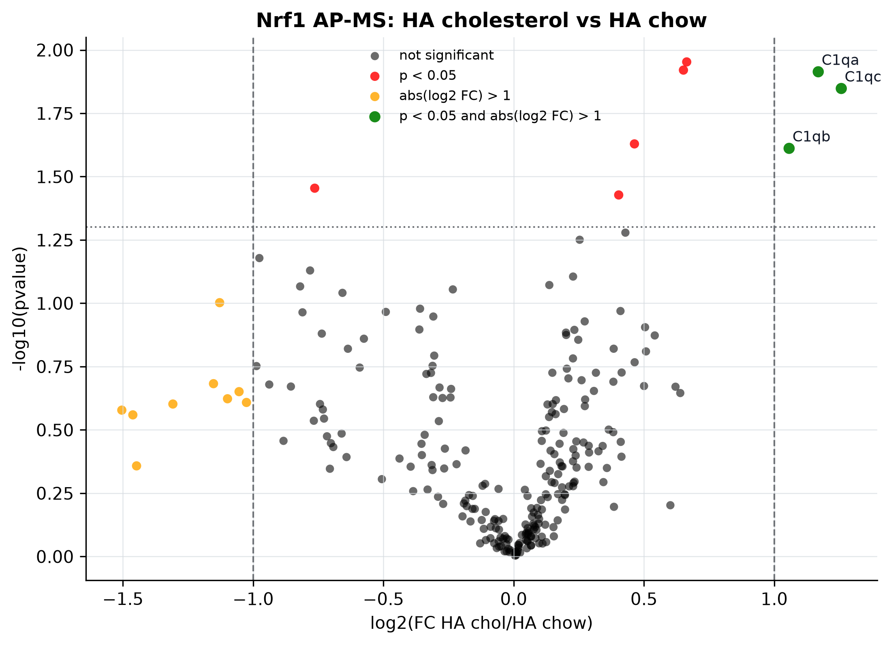
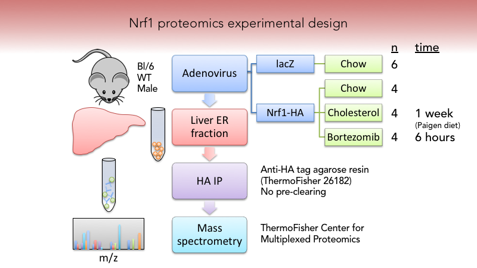
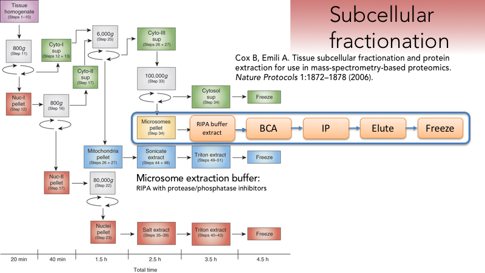
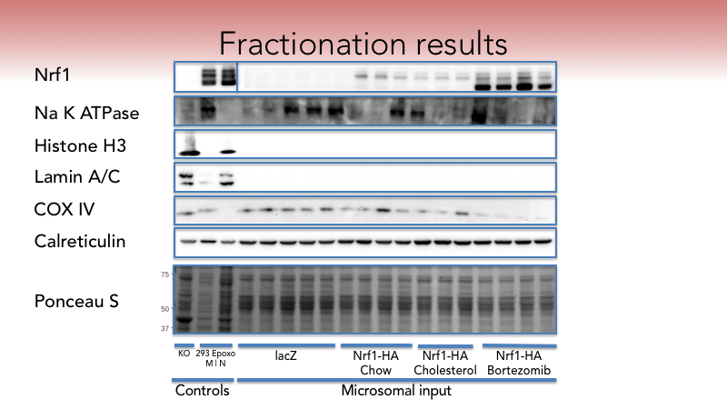
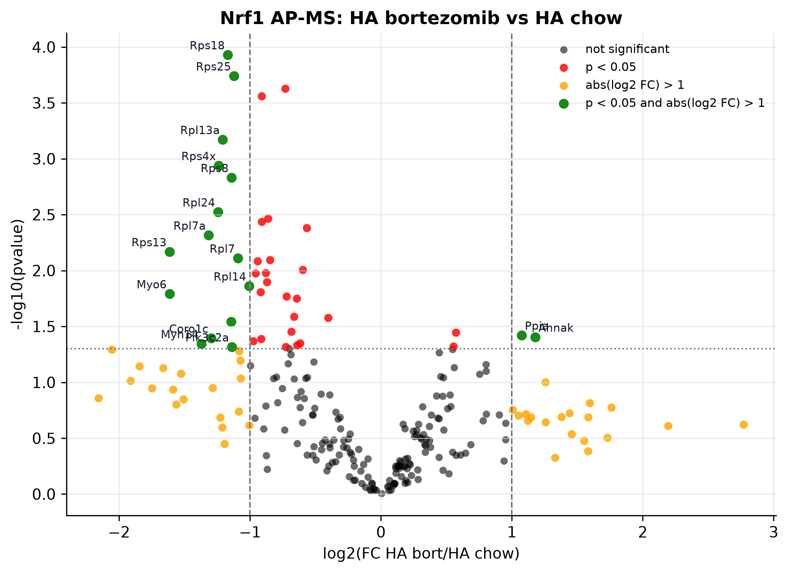
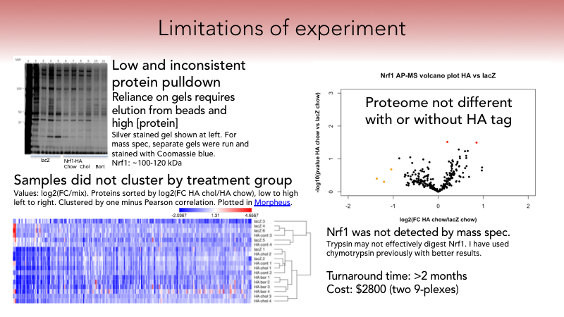
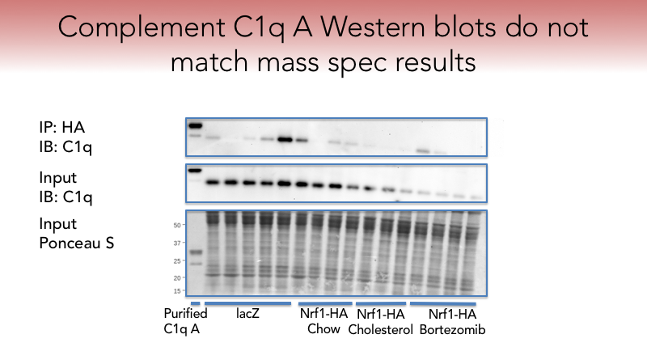
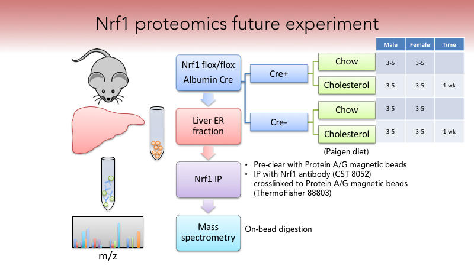

# Nrf1 proteomics

_Proteomics experiments and reproducible data analysis_



## Quickstart

Install [Hatch](https://hatch.pypa.io/latest/), then run the analysis from this directory.

```sh
hatch run analyze && hatch run plot
```

## Description

This repository contains data and analyses from a scientific experiment. The goal of this experiment was to identify a [molecular complex](https://en.wikipedia.org/wiki/Protein_complex) associated with [Nrf1](https://en.wikipedia.org/wiki/NFE2L1) (_NFE2L1_, not to be confused with Nuclear Respiratory Factor 1).

Nrf1 was selected for study because it resides on the surface of a [cellular organelle](https://en.wikipedia.org/wiki/Organelle) called the [Endoplasmic Reticulum](https://en.wikipedia.org/wiki/Endoplasmic_reticulum) (ER). The ER is involved in [metabolism](https://en.wikipedia.org/wiki/Metabolism). Cholesterol metabolism occurs at the ER and is particularly important in the liver, where cholesterol is metabolized and prepared for excretion. Some preliminary evidence suggested that Nrf1 might mediate cholesterol metabolism independently from its known function as a genetic transcription factor in the nucleus.

The hypothesis was that a complex of other proteins interacts with Nrf1 to mediate its response to cholesterol at the ER. The hypothesis was tested with [proteomics](https://en.wikipedia.org/wiki/Proteomics), which identifies all possible proteins in a sample with a technique called [mass spectrometry](https://en.wikipedia.org/wiki/Mass_spectrometry).

## Methods



### Adenovirus

A tagged form of Nrf1 was used to study the Nrf1 protein complex in the context of liver tissue. A tag is a small number of additional amino acids used to more easily isolate and analyze the protein. A C-terminal HA tag (`YPYDVPDYA`) was used.

An [adenoviral vector](https://en.wikipedia.org/wiki/Viral_vector) was used to introduce the HA-tagged Nrf1 gene into mouse liver. The genetic material carried by the virus is incorporated into the mouse genome, and the protein is then produced by liver cells. A lacZ adenovirus was used as a negative control, which is a gene in the lac operon that encodes the beta-galactosidase protein.

Mice were handled in compliance with all ethical guidelines.

### Diets and treatments

The mice were fed either their standard chow diet or a Paigen diet which contains additional ingredients to promote accumulation of cholesterol in the liver. A group of mice also received treatment with the drug Bortezomib as a positive control for Nrf1 activation. Bortezomib is a pharmaceutical compound known to activate the genetic transcriptional functions of Nrf1 by inhibiting the [proteasome](https://en.wikipedia.org/wiki/Proteasome).

### Liver ER fraction and HA IP

The microsomal fraction (containing ER, where Nrf1 resides) was enriched from mouse liver lysates.





The Western blots display protein markers of different [cellular compartments](https://en.wikipedia.org/wiki/Cellular_compartment):

- Na K ATPase is a plasma membrane protein.
- Histone H3 is a nuclear protein that interacts with DNA.
- Lamin A/C are nuclear membrane proteins.
- COX IV is a mitochondrial protein.
- Calreticulin is an ER protein.
- Ponceau S is a total protein stain, used to show equal loading in all lanes.

The three lanes on the left are control samples:

- Lane 1: Nrf1 knockout mouse embryonic fibroblast ("KO" MEF) whole cell lysate. Negative control for presence of Nrf1.
- Lanes 2-3: HEK-293 cells ("293") are a commonly used immortalized human cell line (the cells continuously grow and divide in the lab). HEK-293 cells were used in this experiment as controls for Nrf1 and cellular compartments, and to evaluate antibody reactivity with human and mouse samples. The cells stably expressed Nrf1-HA, were treated with Epoxomycin ("Epoxo") to activate Nrf1, and were fractionated into microsomal ("M") or nuclear ("N") fractions. There is less total protein in the microsomal fraction (lane 2), because HEK-293 cells only yield small amounts of ER, but it is still useful as a qualitative comparison.

Nrf1 was measured, and is shown in the top row. As expected, samples from mice given the adenovirus had more Nrf1. The controls on the left were present on the same Western blot as the microsomal input samples, but a separate image from a shorter blot development exposure is shown because of the extremely strong signal.

**The Western blots demonstrate that the samples are enriched in microsomal proteins, and essentially free of nuclear proteins, but retain proteins from other membrane fractions.**

### Immunoprecipitation

Immediately after enriching the samples for the microsomal fraction, Nrf1 was isolated by immunoprecipitation (IP) for the HA tag. Standard reagents and procedures from ThermoFisher were used.

Further details can be found in the IP protocol and electronic lab notebook entry in the [supplementary data](#supplementary-data).

### Mass spectrometry

A proteomics core facility, the ThermoFisher Center for Multiplexed Proteomics, performed quantitative multiplexed proteomic mass spectrometry analysis on the liver samples. The combination of immunoprecipitation (a type of affinity purification) and mass spectrometry is referred to as affinity purification-mass spectrometry (AP-MS).

Samples were provided to the proteomics core in IP elution buffer.

1. Gel
   - The proteomics core performed a brief gel cleanup before mass spectrometry. They claimed this was helpful because the gels are agnostic to the elution buffer used to obtain the sample. However, a high protein concentration is required because of the small gel loading volume.
   - After mass tagging, they did a 3 hour column separation prior to MS.
   - If samples are divided among multiple runs (as these were), they include an internal "mix" standard for comparison. This is basically a small amount (5 μL) of all the samples mixed together.
   - 30 μL of each sample was then loaded into a 10% Bis-Tris gel and run at 120V for 12 minutes.
   - Gels were stained for 2 hours with Coomassie and destained overnight in water.
   - Additional gels were run and stained with the remaining sample.
   - Gel bands were cut out, destained, reduced and alkylated.
2. Enzyme digestion
   - In-gel trypsin digestion was performed.
3. Tandem Mass Tagging
   - Tandem Mass Tags (TMTs) were used to label primary amine groups. Ten different tags are available, allowing ten samples in the same mass spectrometry run. The tags are isobaric, meaning that they elute at the same time during LC, and have the same mass during MS1 acquisition, but after MS2 peptide sequencing, they fragment into unique ion masses during MS3 reporter ion quantification.
4. Mass spectrometry
   - Peptides were resuspended in 5% acetonitrile, 5% formic acid.
   - Peptides were separated using a gradient of 6 to 28% acetonitrile in 0.125% formic acid over 180 minutes.
   - Half of the sample was shot on an Orbitrap fusion tribrid mass spectrometer.

Further details can be found in the mass spectrometry protocol and electronic lab notebook entry in the [supplementary data](#supplementary-data).

### Data analysis

At the proteomics core:

1. MS2 spectra were searched using the SEQUEST algorithm against a Uniprot composite database derived from the mouse proteome containing its reversed complement and known contaminants.
2. Peptide spectral matches were filtered to a 1% false discovery rate (FDR) using the target-decoy strategy, for determination of incorrectly identified proteins, combined with linear discriminant analysis.
3. Proteins were quantified only from peptides with a summed signal to noise (SN) threshold of ≥200 and MS2 isolation specificity of 0.5, and do not include contaminants or reverse hits.
4. Results were provided by the core facility in a Microsoft Excel workbook containing peptide counts (not sure if they are unique or total peptides) with absolute and relative abundances of all proteins identified in the samples. They also provided a PowerPoint report with methods and preliminary data analysis such as hierarchical clustering performed in GENE-E. They typically do not provide further assistance with data analysis.

Results were received on March 16, 2016.

There was no standardized way to analyze this type of mass spectrometry data, so a custom data analysis pipeline was developed.

The steps performed were:

1. Normalization
   - To compare results across multiple runs, the total summed signal to noise (or normalized relative abundance) for each sample was divided by the corresponding value for the mix standard within that run.
   - This creates a ratio, and log2 transformation should be performed before further analysis.
2. Filtration
   - The hit list was filtered to exclude proteins with ≤2 peptides quantified in all runs.
   - Including only proteins with ≥2 peptides means the identification of the protein itself is confident, because multiple peptides corresponding to it have been identified, and that the identification of the protein is repeatable, because ≥2 peptides were detected in each mass spectrometry run.
3. Transformation
   - log2 transformation was used.
   - `∆Cholesterol=log2((HA chol/mix)/(HA cont/mix))-log2((HA cont/mix)/(lacZ/mix))`
4. Background subtraction
   - Background subtraction was not effective in these samples because protein abundance was greater in lacZ than HA in many cases.
   - Proteins with an HA fold change below 1 (`(HA cont/mix)/(lacZ/mix)<1`) (meaning that the proteins were higher abundance in lacZ samples without the HA tag) could potentially be excluded, but were retained for this analysis.
5. Statistical tests
   - A fold change of 1.5 (log2=0.58) is commonly used as a threshold for biological significance and was used here.
   - Two-sided independent Student t-tests were performed on the untransformed, mix-normalized signal ratios for HA cholesterol versus HA chow, HA bortezomib versus HA chow, and HA chow versus lacZ.
   - Shapiro-Wilk tests were used to assess normality within each treatment group, and median-centered Levene tests were used to assess homogeneity of variance for each t-test.
   - A result with a t-test `p<0.05` was excluded from its volcano plot if it failed the assumptions of the t-test (if its Levene test or either relevant Shapiro-Wilk test also had `p<0.05`).

Further details can be found in the mass spectrometry protocol and electronic lab notebook entry in the [supplementary data](#supplementary-data).

## Results

**Complement C1q proteins were identified as potentially interacting with Nrf1.**

In the volcano plots:

- Each point is a protein.
  - Red if `p<0.05` for the comparison shown
  - Orange if `[log2 fold change]>1`
  - Green if both
- A protein with `p<0.05` is omitted if it fails the assumptions of the t-test.
- log2 transformation is used to normalize positive and negative fold changes.
- `-log10(pvalue)` is used so p values can be plotted as whole numbers.

### Complement C1q A,B, and C were increased in abundance in cholesterol-fed mice


_Figure: volcano plot comparing cholesterol-fed mice with chow-fed control mice._ This plot compares chow-fed mice with mice fed the Paigen diet to promote accumulation of cholesterol in the liver, and demonstrates the increased abundance of Complement C1qA, C1qB, and C1qC in mice fed the Paigen diet.

### Bortezomib alters the proteome



_Figure: volcano plot comparing Bortezomib-treated mice with control mice._ Bortezomib treatment alters the proteome. This is expected given Bortezomib's function as a proteasome inhibitor.

## Limitations



- Low and inconsistent protein pulldown with the HA tag immunoprecipitation. As a result, the proteome was basically the same with (Nrf1-HA adenovirus) or without (lacZ adenovirus) the tagged protein.
- The proteome was not significantly different with or without the HA tag, indicating issues with the HA immunoprecipitation.
- Cluster analysis in Morpheus revealed that the samples did not cluster by treatment group as expected.
- The mass spec core facility required protein to be eluted from agarose immunoprecipitation beads, and then ran the samples on gels, which introduces variability and requires a higher protein concentration than it was possible to provide in these samples. They also had a slow turnaround time, taking over two months to analyze the samples.



_Figure: Nrf1 proteomics C1q Western blot. IP, immunoprecipitation; IB, immunoblot (Western blot)._ Western blot did not clearly validate the mass spectrometry findings.

## Next steps



- Immunoprecipitation of Nrf1 directly instead of the HA tag. This would allow use of Nrf1 liver knockout mice directly without the need for adenovirus. Analysis would include livers with and without Nrf1 (Nrf1 flox Albumin Cre), with and without cholesterol diet, in order to identify cholesterol-responsive Nrf1 interacting proteins.
- Switching to a different mass spectrometry core with a quicker turnaround time that does not require protein elution from beads or running samples through gels.

## Supplementary data

Supplementary data, including the electronic lab notebook, raw data, other data analyses, slides, and more, are available at the [supplementary data URL](./data/supplementary-data.url).

## License

This repository uses separate licenses for code and non-code content.

Code is licensed under the MIT License. See [`LICENSE-CODE`](./LICENSE-CODE).

Prose, documentation, generated figures, and other non-code creative content are licensed under the Creative Commons Attribution-ShareAlike 4.0 International Public License ([CC BY-SA 4.0](https://creativecommons.org/licenses/by-sa/4.0/)). See [`LICENSE`](./LICENSE).

Unless a file says otherwise:

- Source code, tests, configuration files, and scripts are code.
- Prose documentation, written analysis, generated figures, and other narrative or visual content are non-code creative content.
- Data files are included for analysis provenance. Repository-level licenses do not grant rights to third-party material that may be present in data files.

As described in the [GitHub Changelog](https://github.blog/changelog/2022-05-26-easily-discover-and-navigate-to-multiple-licenses-in-repositories/), GitHub uses [Licensee](https://github.com/licensee/licensee) to read license files.
